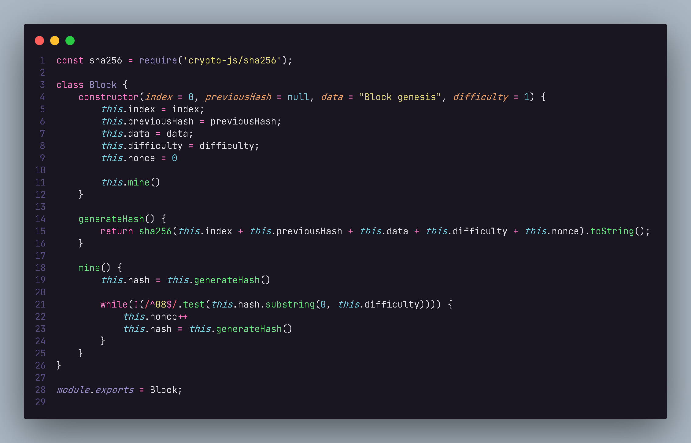
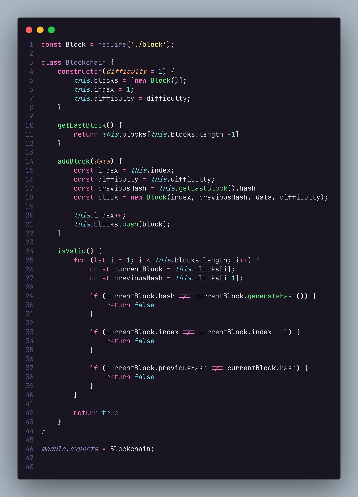

# Exemplo de um blockchain

Este projeto foi feito para fixar melhor meus estudos sobre Blockchain, um projeto simples feito em Node.js

## Classes importantes para o entendimento do projeto

### -> Criação do bloco <-

Esta primeira classe cria um block usando um indice, um hash previo, um dado inicial e uma dificuldade inicial de 1. A função generateHash cria um valor hash usando o SHA256 usando uma concatenação entre todos os valores recebidos. A função mine faz a mineração dos valores tendo obrigatoriamente que ter um valor inicial de 0.

### -> Criação da corrente de blocos <-

Esta classe vai criando a corrente usando a classe anterior, assim, ela criará uma lista de blocos e irá fazer sua validação usando a função isValid, a função getLastHash busca o ultimo valor hash para comparar com o atual, já a função addBlock faz a adição de um bloco usando um dado passado por parametro.

